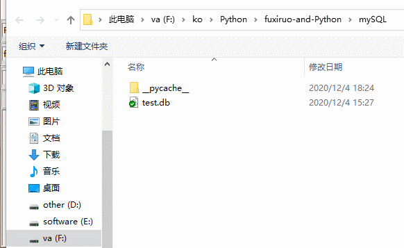
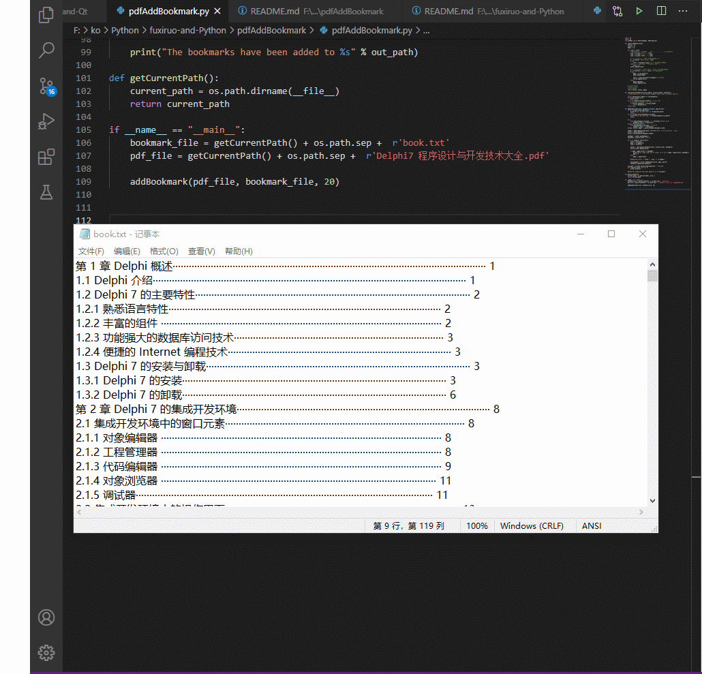

# fuxiruo-and-Python
Python

### 目录
| 编号 | 文件夹 | 描述 |
| ------ | ------ | ------ |
| 1 | common | 代码小片段 |
| 2 | snake | 用tkinter做的简易贪吃蛇 |
| 3 | captcha | 识别登录验证码 学习笔记 |
| 4 | kclassify | K-近邻算法实现手写数字识别系统 学习笔记 |
| 5 | mySQL | SQLite小工具 sqlite3模块和os.popen的使用 |
| 6 | pdfAddBookmark | 利用PyPDF2给pdf文件加书签 |
| 7 | Python Cookbook/struct | struct模块编码解码二进制 |
| 8 | Tesseract-Ocr | Tesseract-OCR识别截屏文字 |
| 9 | autoSetupIss | Inno Setup脚本[Files]字段辅助生成器 |
| 10 | xmlhelper | tkinter+xml+re+excel综合例子 |
| 11 | tinyxmlparse | 简易xml解析器 |

### 效果图

***

***

***

***

### 链接
[代码小片段](common/README.md)

[识别登录验证码学习笔记](captcha/README.md)

[K-近邻算法实现手写数字识别系统 学习笔记](kclassify/README.md)

[利用PyPDF2给pdf文件加书签](pdfAddBookmark/README.md)
