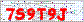

# Python 识别登录验证码学习笔记
实验楼课程 https://www.shiyanlou.com/courses/364/learning/?id=1165




```
from PIL import Image, ImageDraw
im = Image.open('F:/KO/Python/Prj/captcha/captcha.gif')

#（将图片转换为8位像素模式）
im.convert("P")
im.show()

# 打印颜色直方图
print(im.histogram())
```

[0, 0, 0, 0, 0, 0, 0, 0, 0, 0, 0, 0, 0, 0, 0, 0, 0, 0, 0, 0, 0, 0, 0, 0, 0, 0, 0, 0, 0, 0, 0, 0, 0, 0, 0, 0, 0, 0, 0, 0, 0, 0, 0, 1, 1, 0, 0, 0, 0, 0, 0, 0, 0, 1, 0, 0, 2, 0, 0, 0, 0, 1, 0, 0, 0, 0, 0, 2, 1, 0, 0, 0, 0, 0, 0, 0, 0, 0, 0, 1, 0, 0, 0, 0, 1, 0, 0, 0, 0, 0, 0, 2, 1, 0, 0, 0, 2, 0, 0, 0, 0, 1, 0, 1, 1, 0, 0, 1, 0, 2, 0, 0, 0, 0, 0, 0, 0, 0, 0, 0, 0, 1, 2, 0, 0, 0, 1, 2, 0, 1, 0, 0, 1, 0, 2, 0, 0, 1, 0, 0, 2, 0, 0, 0, 0, 0, 0, 0, 0, 1, 0, 1, 0, 1, 0, 3, 1, 3, 3, 0, 0, 0, 0, 0, 0, 1, 0, 3, 2, 132, 1, 1, 0, 0, 0, 1, 2, 0, 0, 0, 0, 0, 0, 0, 15, 0, 1, 0, 1, 0, 0, 8, 1, 0, 0, 0, 0, 1, 6, 0, 2, 0, 0, 0, 0, 18, 1, 1, 1, 1, 1, 2, 365, 115, 0, 1, 0, 0, 0, 135, 186, 0, 0, 1, 0, 0, 0, 116, 3, 0, 0, 0, 0, 0, 21, 1, 1, 0, 0, 0, 2, 10, 2, 0, 0, 0, 0, 2, 10, 0, 0, 0, 0, 1, 0, 625]

颜色直方图的每一位数字都代表了在图片中含有对应位的颜色的像素的数量。

每个像素点可表现 256 种颜色，你会发现白点是最多（白色序号 255 的位置，也就是最后一位，可以看到，有 625 个白色像素）。红像素在序号 200 左右，我们可以通过排序，得到有用的颜色。

下面就是前10位的颜色
```
his = im.histogram()
values = {}

for i in range(256):
    values[i] = his[i]

top_values = {}
for j,k in sorted(values.items(),key=lambda x:x[1],reverse = True)[:10]:
    top_values[j] = k
    print(j, k)
```
255 625
212 365
220 186
219 135
169 132
227 116
213 115
234 21
205 18
184 15

每个像素点可表现 256 种颜色，你会发现白点是最多（白色序号 255 的位置，也就是最后一位，可以看到，有 625 个白色像素）。红像素在序号 200 左右，我们可以通过排序，得到有用的颜色。 我们得到了图片中最多的 10 种颜色，其中 220 与 227 才是我们需要的红色和灰色，可以通过这一讯息构造一种黑白二值图片。

怎么知道220和227就是我们需要的颜色，实验楼里面没说明，下面是我自己想出的方法

```
# 显示直方图前10对应的颜色
im_rectangl = Image.new("RGBA",(600, 100),'black')
draw = ImageDraw.Draw(im_rectangl)
perHeight = im_rectangl.height/len(top_values.items())
index = 0
max_count = max(top_values.values())
for color_index, color_count in top_values.items():
    nowLeftTop = index * perHeight
    nowRightBottom = nowLeftTop + perHeight - 10
    r = im.getpalette()[color_index*3]
    g = im.getpalette()[color_index*3+1]
    b = im.getpalette()[color_index*3+2]
    draw.rectangle((0, nowLeftTop, color_count*im_rectangl.width/max_count, nowRightBottom), fill=(r, g, b))
    draw.text((0,nowLeftTop), str(color_index), fill = (r, g, b))
    index += 1
im_rectangl.show()
im_rectangl.save('R:/histogram.png')
```


构造黑白二值图片
```
im2 = Image.new("P",im.size,255)

for x in range(im.size[0]):
    for y in range(im.size[1]):
        pix = im.getpixel((x,y))
        if pix == 220 or pix == 227: # these are the numbers to get
            im2.putpixel((x,y),0)
im2.show()
im2.save('R:/new.png')
```


接下来的工作是要得到单个字符的像素集合，由于例子比较简单，我们对其进行纵向切割：


所谓纵向切割，就是从左上角坐标开始，从上往下所描，如果像素点都为255白色，说明纵向没有字符，否则就是有字符，没有字符和有字符之间的每个间隔，就是各个字符的分隔

```
inletter = False
foundletter=False
start = 0
end = 0

letters = []

for x in range(im2.size[0]):
    for y in range(im2.size[1]):
        pix = im2.getpixel((x,y))
        if pix != 255:
            inletter = True
    if foundletter == False and inletter == True:
        foundletter = True
        start = x

    if foundletter == True and inletter == False:
        foundletter = False
        end = x
        letters.append((start,end))

    inletter=False
print(letters)
```
输出：
[(6, 14), (15, 25), (27, 35), (37, 46), (48, 56), (57, 67)]

根据坐标，对图片进行切割，得到每个字符所在的那部分图片
```
import hashlib
import time

count = 0
for letter in letters:
    # 前两个值为左上角坐标
    # 后两个值为右下角坐标
    im3 = im2.crop(( letter[0] , 0, letter[1],im2.size[1] ))
    im3.save("./%s.gif"%(count))
    count += 1
```


## AI 与向量空间图像识别 

在这里我们使用向量空间搜索引擎来做字符识别，它具有很多优点：

    不需要大量的训练迭代
    不会训练过度
    你可以随时加入／移除错误的数据查看效果
    很容易理解和编写成代码
    提供分级结果，你可以查看最接近的多个匹配
    对于无法识别的东西只要加入到搜索引擎中，马上就能识别了。

当然它也有缺点，例如分类的速度比神经网络慢很多，它不能找到自己的方法解决问题等等。

关于向量空间搜索引擎的原理可以参考这篇文章：http://ondoc.logand.com/d/2697/pdf

向量空间搜索引擎名字听上去很高大上其实原理很简单，拿文章里的例子来说：

你有 3 篇文档，我们要怎么计算它们之间的相似度呢？2 篇文档所使用的相同的单词越多，那这两篇文章就越相似！但是这单词太多怎么办，就由我们来选择几个关键单词，选择的单词又被称作特征，每一个特征就好比空间中的一个维度（x，y，z 等），一组特征就是一个矢量，每一个文档我们都能得到这么一个矢量，只要计算矢量之间的夹角就能得到文章的相似度了。

用 Python 类实现向量空间：
```
import math

class VectorCompare:
    # 计算矢量大小
    def magnitude(self,concordance):
        total = 0
        for word,count in concordance.items():
            total += count ** 2
        return math.sqrt(total)

    # 计算矢量之间的 cos 值
    def relation(self,concordance1, concordance2):
        relevance = 0
        topvalue = 0
        for word, count in concordance1.items():
            if word in concordance2:
                topvalue += count * concordance2[word]
        return topvalue / (self.magnitude(concordance1) * self.magnitude(concordance2))
```

向量的理解可以参照下面这个链接:
https://zhuanlan.zhihu.com/p/110929407

那么字典和向量怎么理解呢，我们数学的二维向量(3, 4)的含义就是x维度上的值是3，y维度上的值是4，对于字典，就是一个N维的向量(字典的len就是它的维度)，字典的value表示在字典的key维度上的数值。

也就是说，字典相当于向量(value1, value2, ..., valueN),它的模为：

$$||\vec{x}|| = \sqrt{value1^2 + value2^2 + ... + valueN^2}$$

计算夹角
```
设a,b是两个不为0的向量，它们的夹角为<a,b> (或用αdu ,β, θ ,..,字母表示)

1、由向量积公式：cos<a,b>=a.b/|a||b|.①

2、若向量用坐标表示，a=(x1,y1,z1), b=(x2,y2,z2),

则,a.b=(x1x2+y1y2+z1z2).

|a|=√(x1^2+y1^2+z1^2), |b|=√(x2^2+y2^2+z2^2).
```

对应到代码上：
```
for word, count in concordance1.items():
    if word in concordance2:#两个字典同一个维度上的乘积
```

全部代码如下：
```
from PIL import Image
import hashlib
import time
import os
import math

work_path = os.path.split(os.path.realpath(__file__))[0]

# 向量计算
class VectorCompare:
    def magnitude(self,concordance):
        total = 0
        for word,count in concordance.items():
            total += count ** 2
        return math.sqrt(total)

    def relation(self,concordance1, concordance2):
        relevance = 0
        topvalue = 0
        for word, count in concordance1.items():
            if word in concordance2:
                topvalue += count * concordance2[word]
        return topvalue / (self.magnitude(concordance1) * self.magnitude(concordance2))

# 图片转换为向量
def buildvector(im):
    d1 = {}

    '''
    如果图像的模式是“1”，“L”，“P”等模式，因为这些模式是8bit表示一个像素，所以这些模式的颜色值的范围是在0~255，
    所以getdata（）的返回值的元素就不是上述的（R,G,B）的形式了，而是0~255中的任意一个数
    '''
    count = 0
    for i in im.getdata():# 这里其实是把每个像素点的颜色作为一个向量维度，也就是说只能识别相同尺寸大小相同字体的验证码图片
        d1[count] = i
        count += 1

    return d1

v = VectorCompare()


iconset = ['0','1','2','3','4','5','6','7','8','9','0','a','b','c','d','e','f','g','h','i','j','k','l','m','n','o','p','q','r','s','t','u','v','w','x','y','z']

imageset = []

for letter in iconset:
    temp = []
    for img in os.listdir('{}/iconset/{}/'.format(work_path, letter)):
        if img != "Thumbs.db" and img != ".DS_Store": # windows check...
            img_file = "{}/iconset/{}/{}".format(work_path, letter, img)
            #print("{} add {}".format(letter, img_file))
            temp.append(buildvector(Image.open(img_file)))
    imageset.append({letter:temp})

im = Image.open("{}/captcha.gif".format(work_path))
im2 = Image.new("P",im.size,255)
im.convert("P")
temp = {}

for x in range(im.size[0]):
    for y in range(im.size[1]):
        pix = im.getpixel((x,y))
        temp[pix] = pix
        if pix == 220 or pix == 227: # these are the numbers to get
            im2.putpixel((x,y),0)

inletter = False
foundletter=False
start = 0
end = 0

letters = []

for x in range(im2.size[0]): # slice across
    for y in range(im2.size[1]): # slice down
        pix = im2.getpixel((x,y))
        if pix != 255:
            inletter = True

    if foundletter == False and inletter == True:
        foundletter = True
        start = x

    if foundletter == True and inletter == False:
        foundletter = False
        end = x
        letters.append((start,end))


    inletter=False

count = 0
for letter in letters:
    #print("{} letter ++++++++++++++++++++++++++++++".format(count))
    m = hashlib.md5()
    im3 = im2.crop(( letter[0] , 0, letter[1], im2.size[1]))

    guess = []

    for image in imageset:#imageset每个项都是一个字典
        for x,y in image.items(): #key为代表的字符，value是多张基准字符图片的向量
            #print("key {} len {}".format(x, len(y)))
            for yy in y:
                relation = v.relation(yy,buildvector(im3)) 
                guess.append((relation, x))

    guess.sort(reverse=True)
    print (guess[0])

    count += 1
```