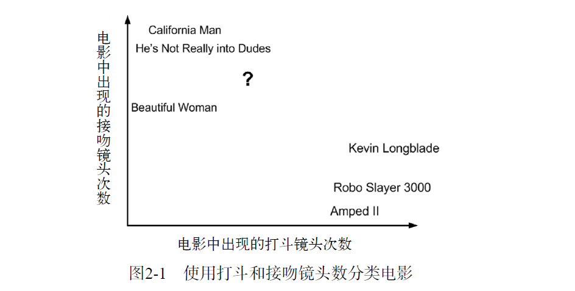

#K-近邻算法实现手写数字识别系统 笔记

实验楼课程 https://www.shiyanlou.com/courses/777/learning/

众所周知，电影可以按照题材分类，然而题材本身是如何定义的？由谁来判定某部电影属于哪个题材？也就是说同一题材的电影具有哪些公共特征？这些都是在进行电影分类时必须要考虑的问题。

没有哪个电影人会说自己制作的电影和以前的某部电影类似，但我们确实知道每部电影在风格上的确有可能会和同题材的电影相近。那么动作片具有哪些共有特征，使得动作片之间非常类似，而与爱情片存在着明显的差别呢？

动作片中也会存在接吻镜头，爱情片中也会存在打斗场景，我们不能单纯依靠是否存在打斗或者亲吻来判断影片的类型。但是爱情片中的亲吻镜头更多，动作片中的打斗场景也更频繁，基于此类场景在某部电影中出现的次数可以用来进行电影分类。

本章第一节基于电影中出现的亲吻、打斗出现的次数，使用 K 近邻算法构造程序，自动划分电影的题材类型。我们首先使用电影分类讲解 K 近邻算法的基本概念，然后学习如何在其他系统上使用 K 近邻算法。

## K 近邻算法概述

简单地说，K 近邻算法采用测量不同特征值之间的距离方法进行分类。它具有的优缺点如下：

- 优点：精度高、对异常值不敏感、无数据输入假定。
- 缺点：计算复杂度高、空间复杂度高。

K 近邻算法适用数据范围为：数值型和标称型。

K 近邻算法的工作原理是：存在一个样本数据集合，也称作训练样本集，并且样本集中每个数据都存在标签，即我们知道样本集中每一数据与所属分类的对应关系。

输入没有标签的新数据后，将新数据的每个特征与样本集中数据对应的特征进行比较，然后算法提取样本集中特征最相似数据（最近邻）的分类标签。一般来说，我们只选择样本数据集中前 kkk 个最相似的数据，这就是 K 近邻算法中 kkk 的出处，通常 kkk 是不大于 20 的整数。最后，选择 kkk 个最相似数据中出现次数最多的分类，作为新数据的分类。

现在我们回到前面电影分类的例子，使用 K 近邻算法分类爱情片和动作片。有人曾经统计过很多电影的打斗镜头和接吻镜头，图 2-1 显示了 6 部电影的打斗和接吻镜头数。假如有一部未看过的电影，如何确定它是爱情片还是动作片呢？我们可以使用 K 近邻 来解决这个问题。

    

首先我们需要知道这个未知电影存在多少个打斗镜头和接吻镜头，图 2-1 中问号位置是该未知电影出现的镜头数图形化展示，具体数字参见表 1。

表 1 每部电影的打斗镜头数、接吻镜头数以及电影评估类型

| 电影名称      |	打斗镜头 |	接吻镜头    | 电影类型 |
| ------        | ------    | ------      | ------ |
| California Man 	| 3 	    | 104 	| 爱情片
| He’s Not Really into Dudes 	| 2 	| 100 	| 爱情片 |
| Beautiful Woman 	| 1 	    | 81 	|爱情片 |
| Kevin Longblade 	| 101 	    | 10 	| 动作片 |
| Robo Slayer 3000 	| 99 	    | 5 	| 动作片 |
| Amped II 	        | 98 	    | 2 	| 动作片
| ? 	            | 18 	    | 90 	| 未知

即使不知道未知电影属于哪种类型，我们也可以通过某种方法计算出来。首先计算未知电影与样本集中其他电影的距离，如表 2 所示。此处暂时不要关心如何计算得到这些距离值，使用 Python 实现电影分类应用时，会提供具体的计算方法。

表 2 已知电影与未知电影的距离

| 电影名称      | 与未知电影的距离 |
|-              | -              |
|California Man 	| 20.5
|He’s Not Really into Dudes 	| 18.7
|Beautiful Woman 	| 19.2
|Kevin Longblade 	| 115.3
|Robo Slayer 3000 	| 117.4
|Amped II 	| 118.9

现在我们得到了样本集中所有电影与未知电影的距离，按照距离递增排序，可以找到 kkk 个距离最近的电影。假定 k=3k=3k=3，则三个最靠近的电影依次是 He’s Not Really into Dudes、Beautiful Woman 和 California Man。K 近邻算法按照距离最近的三部电影的类型，决定未知电影的类型，而这三部电影全是爱情片，因此我们判定未知电影是爱情片。

本章主要讲解如何在实际环境中应用 K 近邻算法，同时涉及如何使用 Python 工具和相关的机器学习术语。按照开发机器学习应用的通用步骤，我们使用 Python 语言开发 K 近邻算法的简单应用，以检验算法使用的正确性。

### K 近邻算法的一般流程

    1.收集数据：可以使用任何方法。   
    2.准备数据：距离计算所需要的数值，最好是结构化的数据格式。
    3.分析数据：可以使用任何方法。
    4.训练算法：此步骤不适用于 K 近邻算法。
    5.测试算法：计算错误率。
    6.使用算法：首先需要输入样本数据和结构化的输出结果，然后运行K 近邻算法判定输7.入数据分别属于哪个分类，最后应用对计算出的分类执行后续的处理。


## 准备：使用 Python 导入数据

```
import numpy as np

def createDataSet():
    group = np.array([[1.0, 1.1], [1.0, 1.0], [0, 0], [0, 0.1]])
    labels = ['A', 'A', 'B', 'B']
    return group, labels
```

在上面的代码中，我们导入科学计算包 NumPy，K 近邻算法执行排序操作时将使用这个模块提供的函数。

然后，我们尝试加载这些数据。

```
group, labels = createDataSet()

print('group:', group)
print('labels:', labels)  # 输出数值
```

上述命令创建了变量 group 和 labels，在 Python 命令提示符下输入下列命令，输入变量的名字以检验是否正确地定义变量：

这里有 4 组数据，每组数据有两个我们已知的属性或者特征值。上面的 group 矩阵每行包含一个不同的数据，我们可以把它想象为某个日志文件中不同的测量点或者入口。由于人类大脑的限制，我们通常只能可视化处理三维以下的事务。因此为了简单地实现数据可视化，对于每个数据点我们通常只使用两个特征。

向量 labels 包含了每个数据点的标签信息，labels 包含的元素个数等于 group 矩阵行数。这里我们将数据点 (1, 1.1) 定义为类 A，数据点 (0, 0.1) 定义为类 B。为了说明方便，例子中的数值是任意选择的，并没有给出轴标签，图 2-2 是带有类标签信息的四个数据点。

 

现在我们已经知道 Python 如何解析数据，如何加载数据，以及 K 近邻 算法的工作原理，接下来我们将使用这些方法完成分类任务。
如何测试分类器

在上文中我们提到使用 K 近邻 算法能够判断出一个电影是动作片还是爱情片，即我们使用 K 近邻 算法能够实现一个分类器。我们需要检验分类器给出的答案是否符合我们的预期。读者可能会问：「分类器何种情况下会出错？」或者「答案是否总是正确的？」

答案是否定的，分类器并不会得到百分百正确的结果，我们可以使用多种方法检测分类器的正确率。此外分类器的性能也会受到多种因素的影响，如分类器设置和数据集等。不同的算法在不同数据集上的表现可能完全不同，这也是本部分的 6 章都在讨论分类算法的原因所在。

为了测试分类器的效果，我们可以使用已知答案的数据，当然答案不能告诉分类器，检验分类器给出的结果是否符合预期结果。通过大量的测试数据，我们可以得到分类器的错误率：分类器给出错误结果的次数除以测试执行的总数。

错误率是常用的评估方法，主要用于评估分类器在某个数据集上的执行效果。完美分类器的错误率为 0，最差分类器的错误率是 1.0，在这种情况下，分类器根本就无法找到一个正确答案。读者可以在后面章节看到实际的数据例子。

上一节介绍的例子已经可以正常运转了，但是并没有太大的实际用处。接下来本书将使用手写识别系统的测试程序检测 K 近邻算法的效果。
开发准备

本节我们一步步地构造使用 K 近邻分类器的手写识别系统。为了简单起见，这里构造的系统只能识别数字 0 到 9，参见图 2-6。需要识别的数字已经使用图形处理软件，处理成具有相同的色彩和大小 1：宽高是 32 像素 x 32 像素的黑白图像。

尽管采用文本格式存储图像不能有效地利用内存空间，但是为了方便理解，我们还是将图像转换为文本格式。

1. 该数据集合修改自 "手写数字数据集的光学识别" 一文中的数据集合，该文登载于 2010 年 10 月 3 日的 UCI 机器学习资料库中 http://archive.ics.uci.edu/ml。作者是土耳其伊斯坦布尔海峡大学计算机工程系的 E. Alpaydin 与 C. Kaynak。


下面下载实验所需资料：

下载数据集：

wget -nc "http://labfile.oss.aliyuncs.com/courses/777/digits.zip"
unzip -o digits.zip

digits 目录下有两个文件夹，分别是:

    trainingDigits：训练数据，1934 个文件，每个数字大约 200 个文件。
    testDigits：测试数据，946 个文件，每个数字大约 100 个文件。

每个文件中存储一个手写的数字，文件的命名类似 0_7.txt，第一个数字 0 表示文件中的手写数字是 0，后面的 7 是个序号。

我们使用目录 trainingDigits 中的数据训练分类器，使用目录 testDigits 中的数据测试分类器的效果。两组数据没有重叠，你可以检查一下这些文件夹的文件是否符合要求。根据这些数据我们开始实现 K 近邻算法。

实验步骤
准备数据：将图像转换为测试向量

为了使用前面两个例子的分类器，我们必须将图像格式化处理为一个向量。我们将把一个 32x32 的二进制图像矩阵转换为 1x1024 的向量，这样前两节使用的分类器就可以处理数字图像信息了。

我们首先编写一段函数 img2vector，将图像转换为向量：该函数创建 1x1024 的 NumPy 数组，然后打开给定的文件，循环读出文件的前 32 行，并将每行的头 32 个字符值存储在 NumPy 数组中，最后返回数组。

```
def img2vector(filename):
    # 创建向量
    returnVect = np.zeros((1, 1024))
    # 打开数据文件，读取每行内容
    fr = open(filename)
    for i in range(32):
        # 读取每一行
        lineStr = fr.readline()
        # 将每行前 32 字符转成 int 存入向量
        for j in range(32):
            returnVect[0, 32*i+j] = int(lineStr[j])

    return returnVect
```
然后，测试 img2vector 函数：

```
img2vector('digits/testDigits/0_1.txt')
```

分析数据

K 近邻算法我们在理论学习部分已经有所了解，本节内容将实现这个算法的核心部分：计算「距离」。

当我们有一定的样本数据和这些数据所属的分类后，输入一个测试数据，就可以根据算法得出该测试数据属于哪个类别，此处的类别为 0-9 十个数字，就是十个类别。

算法实现过程：

    1.计算已知类别数据集中的点与当前点之间的距离；
    2.按照距离递增次序排序；
    3.选取与当前点距离最小的 k 个点；
    4.确定前 k 个点所在类别的出现频率；
    5.返回前 k 个点出现频率最高的类别作为当前点的预测分类。

```
import operator

def classify0(inX, dataSet, labels, k):

    """
    参数: 
    - inX: 用于分类的输入向量
    - dataSet: 输入的训练样本集
    - labels: 样本数据的类标签向量
    - k: 用于选择最近邻居的数目
    """

    # 获取样本数据数量
    dataSetSize = dataSet.shape[0]

    # 矩阵运算，计算测试数据与每个样本数据对应数据项的差值
    diffMat = np.tile(inX, (dataSetSize, 1)) - dataSet

    # sqDistances 上一步骤结果平方和
    sqDiffMat = diffMat**2
    sqDistances = sqDiffMat.sum(axis=1)

    # 取平方根，得到距离向量
    distances = sqDistances**0.5

    # 按照距离从低到高排序
    sortedDistIndicies = distances.argsort()
    classCount = {}

    # 依次取出最近的样本数据
    for i in range(k):
        # 记录该样本数据所属的类别
        voteIlabel = labels[sortedDistIndicies[i]]
        classCount[voteIlabel] = classCount.get(voteIlabel, 0) + 1

    # 对类别出现的频次进行排序，从高到低
    sortedClassCount = sorted(
        classCount.items(), key=operator.itemgetter(1), reverse=True)

    # 返回出现频次最高的类别
    return sortedClassCount[0][0]
```

这里，使用欧氏距离公式，计算两个向量点 X<sub>a​</sub>和 X<sub>b​</sub>之间的距离：

$$d=\sqrt{ (X_{a0}-X_{b0})^{2}+ (X_{a1}-X_{b1})^{2}}$$

​

例如，点 (0,0) 与 (1,2)间的距离计算为：

$$d=\sqrt{ (1-0)^{2}+ (2-0)^{2}}$$

​

如果数据集存在 4 个特征值，则点 (1,0,0,1)) 与 (7,6,9,4) 之间的距离计算为：

$$d=\sqrt{ (7-1)^{2}+ (6-0)^{2}+ (9-0)^{2}+ (4-1)^{2}}$$

​

计算完所有点之间的距离后，可以对数据按照从小到大的次序排序。然后，确定前 k 个距离最小元素所在的主要分类，输入 k 总是正整数；最后，将 classCount 字典分解为元组列表，然后使用程序第二行导入运算符模块的 itemgetter 方法，按照第二个元素的次序对元组进行排序。

此处的排序为逆序，即按照从最大到最小次序排序，最后返回发生频率最高的元素标签。

为了预测数据所在分类，在 Python 提示符中输入下列命令：

```
group, labels = createDataSet()
classify0([0, 0], group, labels, 3)
```

输出结果应该是 B，大家也可以改变输入 [0, 0] 为其他值，测试程序的运行结果。

到现在为止，我们已经构造了第一个分类器，使用这个分类器可以完成很多分类任务。从这个实例出发，构造使用分类算法将会更加容易。
测试算法：使用 K 近邻算法识别手写数字

我们已经将数据处理成分类器可以识别的格式。接下来，我们将这些数据输入到分类器，检测分类器的执行效果。在写入这些代码之前，我们必须确保将 from os import listdir 写入文件的起始部分，这段代码的主要功能是从 os 模块中导入函数 listdir，它可以列出给定目录的文件名。

测试的步骤：

    1.读取训练数据到向量（手写图片数据），从数据文件名中提取类别标签列表（每个向量对应的真实的数字）
    2.读取测试数据到向量，从数据文件名中提取类别标签
    3.执行K 近邻算法对测试数据进行测试，得到分类结果
    4.与实际的类别标签进行对比，记录分类错误率
    5.打印每个数据文件的分类数据及错误率作为最终的结果

```
from os import listdir


def handwritingClassTest():
    # 样本数据的类标签列表
    hwLabels = []

    # 样本数据文件列表
    trainingFileList = listdir('digits/trainingDigits')
    m = len(trainingFileList)

    # 初始化样本数据矩阵（M*1024）
    trainingMat = np.zeros((m, 1024))

    # 依次读取所有样本数据到数据矩阵
    for i in range(m):
        # 提取文件名中的数字
        fileNameStr = trainingFileList[i]
        fileStr = fileNameStr.split('.')[0]
        classNumStr = int(fileStr.split('_')[0])
        hwLabels.append(classNumStr)

        # 将样本数据存入矩阵
        trainingMat[i, :] = img2vector(
            'digits/trainingDigits/%s' % fileNameStr)

    # 循环读取测试数据
    testFileList = listdir('digits/testDigits')

    # 初始化错误率
    errorCount = 0.0
    mTest = len(testFileList)

    # 循环测试每个测试数据文件
    for i in range(mTest):
        # 提取文件名中的数字
        fileNameStr = testFileList[i]
        fileStr = fileNameStr.split('.')[0]
        classNumStr = int(fileStr.split('_')[0])

        # 提取数据向量
        vectorUnderTest = img2vector('digits/testDigits/%s' % fileNameStr)

        # 对数据文件进行分类
        classifierResult = classify0(vectorUnderTest, trainingMat, hwLabels, 3)

        # 打印 K 近邻算法分类结果和真实的分类
        print("测试样本 %d, 分类器预测: %d, 真实类别: %d" %
              (i+1, classifierResult, classNumStr))

        # 判断K 近邻算法结果是否准确
        if (classifierResult != classNumStr):
            errorCount += 1.0

    # 打印错误率
    print("\n错误分类计数: %d" % errorCount)
    print("\n错误分类比例: %f" % (errorCount/float(mTest)))
```

上面的代码中，将 trainingDigits 目录中的文件内容存储在列表中，然后可以得到目录中有多少文件，并将其存储在变量 m 中。接着，代码创建一个 m 行 1024 列的训练矩阵，该矩阵的每行数据存储一个图像。

我们可以从文件名中解析出分类数字。该目录下的文件按照规则命名，如文件 9_45.txt 的分类是 9，它是数字 9 的第 45 个实例。然后我们可以将类代码存储在 hwLabels 向量中，使用前面讨论的 img2vector 函数载入图像。

在下一步中，我们对 testDigits 目录中的文件执行相似的操作，不同之处是我们并不将这个目录下的文件载入矩阵中，而是使用 classify0() 函数测试该目录下的每个文件。

最后，我们输入 handwritingClassTest()，测试该函数的输出结果。

K 近邻算法识别手写数字数据集，错误率为 1.05%。改变变量 k 的值、修改函数 handwritingClassTest 随机选取训练样本、改变训练样本的数目，都会对 K 近邻算法的错误率产生影响，感兴趣的话可以改变这些变量值，观察错误率的变化。
实验总结

K 近邻算法是分类数据最简单有效的算法。K 近邻算法是基于实例的学习，使用算法时我们必须有接近实际数据的训练样本数据。K 近邻算法必须保存全部数据集，如果训练数据集很大，必须使用大量的存储空间。此外，由于必须对数据集中的每个数据计算距离值实际使用是可能非常耗时。是否存在一种算法减少存储空间和计算时间的开销呢？K 决策树就是 K 近邻算法的优化版，可以节省大量的计算开销。